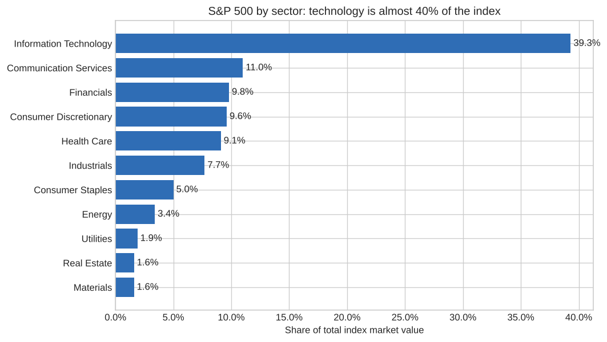
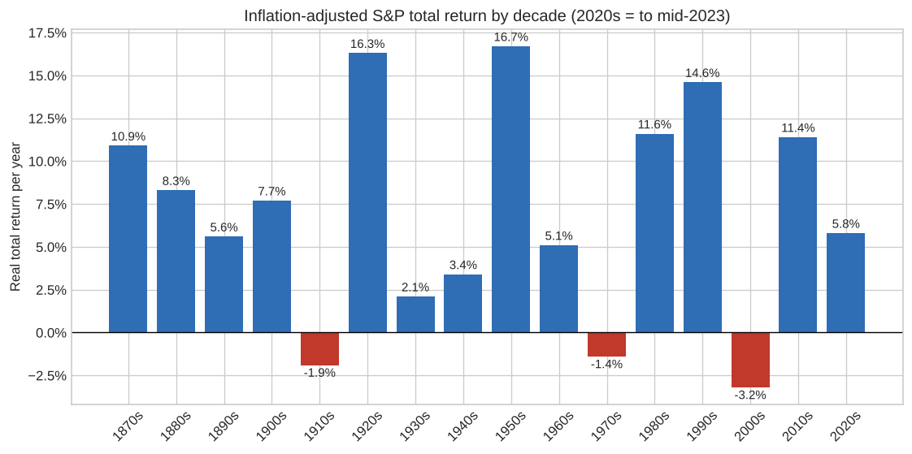
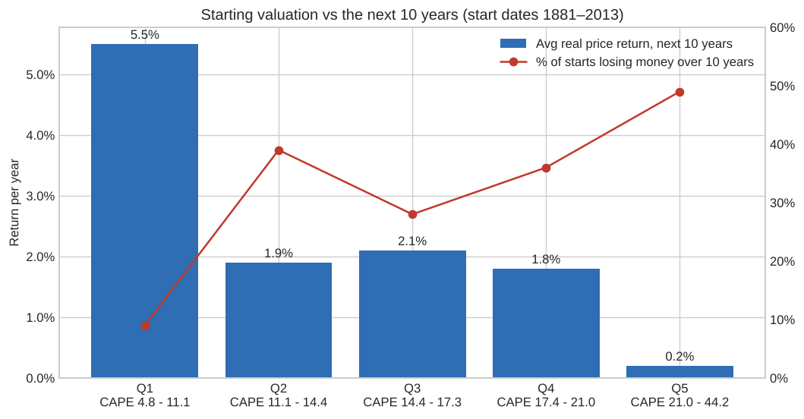

# S&P 500 Market Analysis in SQL

Ten business questions about the US stock market, each answered with a single SQL query. The project uses two real datasets: **today's 503 S&P 500 companies** with their valuations, and **Robert Shiller's monthly market history going back to 1871**.

**Tools:** SQL (SQLite) · Python (Pandas, Matplotlib) for loading data and drawing charts

**SQL techniques used:** joins · views · CTEs · window functions (`ROW_NUMBER`, `RANK`, `NTILE`, `LAG`, `LEAD`, running `SUM`/`MAX`) · conditional aggregation · gaps-and-islands · compounding returns with `EXP(SUM(LN(...)))`

👉 **[See every query's output](results/README.md)** · **[Browse the SQL](queries/)**

## Key findings

**1. The index is highly concentrated.** The 10 largest companies make up **42.9%** of the S&P 500's value, and Nvidia alone is 8.5%. Technology is **39%** of the index. ([Q1](queries/01_sector_composition.sql), [Q2](queries/02_concentration.sql))



**2. A simple average gives the wrong answer for valuations.** The average P/E across tech companies is 132, distorted by a few companies with tiny earnings. Weighted by market value, tech's P/E is **33.5**, still the most expensive sector. Financials (15.7) and Energy and Utilities (18.5) are the cheapest. ([Q3](queries/03_sector_valuation.sql))

**3. Long-run real returns are strong, but some decades lose money.** After inflation, the 1950s returned 16.7% a year, but the 1910s, 1970s and 2000s all lost money in real terms. ([Q7](queries/07_real_returns_by_decade.sql))



**4. Recovering from a crash can take decades.** After 1929, the market fell **80.6%** in real terms and took **29 years** to reach a new inflation-adjusted high. The 2000–2009 bear market (−58.6%) took 14 years. ([Q8](queries/08_worst_drawdowns.sql))

**5. Starting valuation matters.** When the Shiller CAPE ratio was in its cheapest fifth, the next 10 years averaged **5.5%** real price growth a year, and only 9% of start dates lost money. In the most expensive fifth (CAPE above 21), returns averaged **0.2%**, and **49%** of start dates lost money over the following decade. ([Q9](queries/09_cape_vs_future_returns.sql))



## The ten questions

| # | Business question | Main technique |
|---|---|---|
| 1 | [Which sectors make up the index, by count and by value?](queries/01_sector_composition.sql) | `SUM() OVER ()` for % of total |
| 2 | [How concentrated is the index in its largest companies?](queries/02_concentration.sql) | Running total window |
| 3 | [Which sectors look expensive or cheap?](queries/03_sector_valuation.sql) | Market-cap-weighted ratios |
| 4 | [What are the top 3 dividend payers in each sector?](queries/04_top_dividend_payers.sql) | `ROW_NUMBER() OVER (PARTITION BY)` |
| 5 | [Which large companies are cheaper than their sector and pay more dividends?](queries/05_value_screen.sql) | CTE benchmark joined back |
| 6 | [When did today's members join the index?](queries/06_index_membership.sql) | `CASE` pivot by decade |
| 7 | [What real return did stocks deliver each decade?](queries/07_real_returns_by_decade.sql) | `LAG()` + log compounding |
| 8 | [What were the worst bear markets, and how long was recovery?](queries/08_worst_drawdowns.sql) | Running `MAX()`, gaps-and-islands |
| 9 | [Does a high valuation predict lower future returns?](queries/09_cape_vs_future_returns.sql) | `LEAD()` + `NTILE()` |
| 10 | [What were the best and worst calendar years?](queries/10_calendar_year_returns.sql) | `RANK()` top and bottom N |

## Database design

```
companies (503 rows)          financials (461 rows)           market_history (1,869 rows)
─────────────────────         ──────────────────────          ───────────────────────────
symbol  PK  ◄──────────────── symbol  PK/FK                   month  PK  (1871-01 → 2026-09)
name, sector, sub_industry    price, pe_ratio, eps            sp500, dividend, earnings
headquarters, date_added      dividend_yield, market_cap      cpi, long_rate, cape
cik, founded                  ebitda, price_sales, price_book real_price, real_dividend ...

issuers (view): one row per company, so firms with two share classes aren't counted twice
```

The full schema with comments is in [`schema.sql`](schema.sql).

## Data cleaning decisions

- **Duplicate share classes.** Alphabet, Fox and News Corp have two listed share classes, and the source reports the *whole* company's market value on both. Counted naively, Alphabet would be double-counted (about $4.2 trillion). The `issuers` view keeps one row per company, identified by its SEC CIK number.
- **Zeros that mean "missing".** The history file uses `0` where data isn't available yet (dividends after mid-2023, CAPE before 1881). These are loaded as `NULL` so they can't distort averages.
- **Loss-making companies.** A negative P/E isn't meaningful, so valuation queries exclude companies with P/E ≤ 0.
- **Missing financials.** 42 of the 503 companies have no valuation data in the source and are excluded from Q1–Q5.

## Run it yourself

```bash
pip install -r requirements.txt
python load_data.py      # builds sp500.db from the CSVs
python run_queries.py    # runs all queries, writes results/ and images/
```

You can also open `sp500.db` in [DB Browser for SQLite](https://sqlitebrowser.org/) and run any query by hand.

## Sources and limitations

- Company list: [datasets/s-and-p-500-companies](https://github.com/datasets/s-and-p-500-companies) (from Wikipedia)
- Valuations: [datasets/s-and-p-500-companies-financials](https://github.com/datasets/s-and-p-500-companies-financials) (from Yahoo Finance), a single snapshot downloaded October 2026
- Market history: [datasets/s-and-p-500](https://github.com/datasets/s-and-p-500), Robert Shiller's data. Dividends, CPI and CAPE run to mid-2023; index prices after that come from FRED.
- Shiller prices are **monthly averages**, so calendar-year and drawdown figures are smoother than daily closing prices would show.
- Q9 measures real *price* returns. Adding the average dividend yield shown in the table gives an approximate total return.
