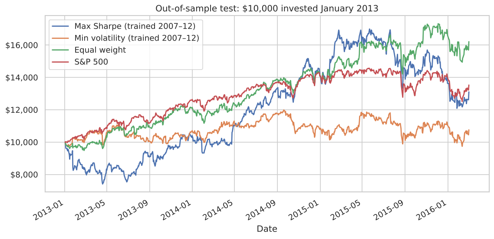
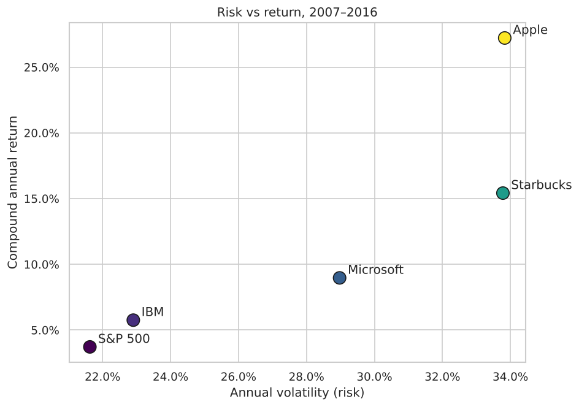
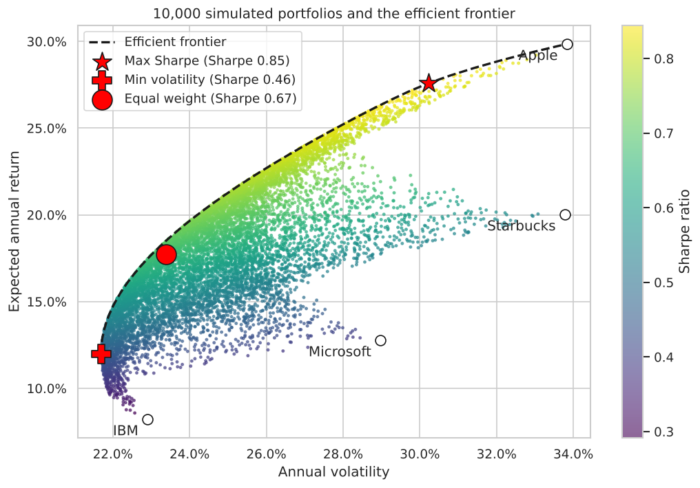
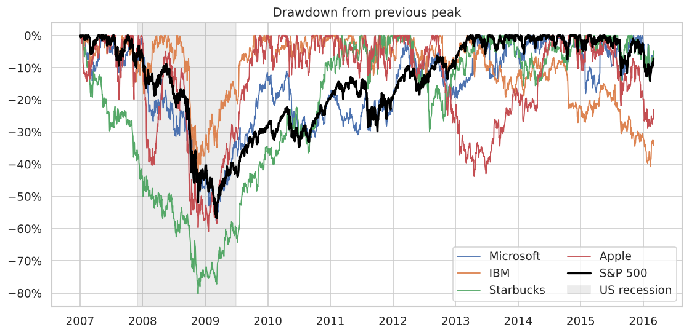
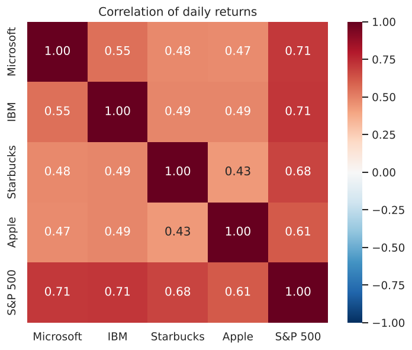

# Stock Portfolio Analysis: Risk, Return and Optimisation

An analysis of Apple, Microsoft, IBM and Starbucks against the S&P 500 from **2007 to 2016**, a period that covers the 2008 financial crisis. It measures risk-adjusted performance, crisis drawdowns and diversification, builds optimal portfolios using Modern Portfolio Theory, and then **tests whether those "optimal" portfolios actually work on data they haven't seen**.

**Tools:** Python · Pandas · NumPy · SciPy (optimisation) · Matplotlib · Seaborn · Jupyter

👉 **[View the full analysis notebook](analysis.ipynb)**

## Key findings

| | |
|---|---|
| 🍎 **Apple was the standout** | $10,000 grew to about $90,700 (27% a year), with the best Sharpe ratio (0.82) |
| 📉 **High return ≠ low risk** | Starbucks was the 2nd-best performer yet fell **80%** from its peak in the crisis |
| 🔗 **Diversification weakens in crises** | Average correlation between the stocks roughly doubled during market sell-offs |
| ⚠️ **Hindsight optimisation fails** | A max-Sharpe portfolio trained on 2007–12 (90% Apple) **lost to a simple equal-weight portfolio** in 2013–16 |

### Out-of-sample test: portfolios chosen using 2007–2012 data, tested on 2013–2016

| Portfolio | $10,000 became | Annual return | Sharpe | Max drawdown |
|---|---|---|---|---|
| **Equal weight (25% each)** | **$16,210** | **16.5%** | **0.87** | **−14.6%** |
| S&P 500 | $13,965 | 10.0% | 0.64 | −14.2% |
| Max Sharpe (trained) | $13,102 | 8.9% | 0.39 | −28.9% |
| Min volatility (trained) | $10,756 | 2.3% | 0.11 | −18.8% |



The optimiser concentrated in the past winner (Apple), but market leadership rotated to Starbucks and Microsoft. This shows why mean-variance optimisation is fragile: it relies on expected returns, and past returns are a poor forecast of future ones. The result is consistent with research showing naive 1/N portfolios are hard to beat out of sample (DeMiguel, Garlappi & Uppal, 2009).

## Charts

| Risk vs return | Efficient frontier |
|---|---|
|  |  |
| **Drawdowns in the financial crisis** | **Correlation of daily returns** |
|  |  |

## What's in the analysis

1. **Data checks and growth of $10,000** for each asset
2. **Risk/return metrics:** CAGR, volatility, Sharpe, Sortino, max drawdown, beta
3. **Crisis analysis:** peak, trough and recovery time for each asset
4. **Diversification:** correlation matrix plus rolling volatility and correlation
5. **Portfolio optimisation:** 10,000 Monte Carlo portfolios, efficient frontier, max-Sharpe and min-volatility portfolios (SciPy SLSQP)
6. **Out-of-sample backtest:** train on 2007–2012, test on 2013–2016

## Project structure

```
stock-portfolio-analysis/
├── analysis.ipynb          # Full analysis with commentary
├── portfolio_metrics.py    # Reusable metric and optimisation functions
├── data/stock_prices.csv   # Daily adjusted closing prices
├── images/                 # Charts exported from the notebook
└── requirements.txt
```

## Run it yourself

```bash
pip install -r requirements.txt
jupyter notebook analysis.ipynb
```

## Data and limitations

- Daily adjusted closing prices from the public [Plotly datasets](https://github.com/plotly/datasets/blob/master/stockdata.csv) repository (Jan 2007 to Mar 2016).
- `GSPC` is the S&P 500 *price* index and excludes dividends, so the index is understated by about 2% a year.
- Four large stocks that all survived the period, so there is survivorship bias.
- No transaction costs or taxes; the backtest is buy-and-hold with no rebalancing. A 2% risk-free rate is assumed.

**Possible extensions:** walk-forward optimisation, Ledoit–Wolf covariance shrinkage, risk-parity weighting, Value-at-Risk / CVaR.
