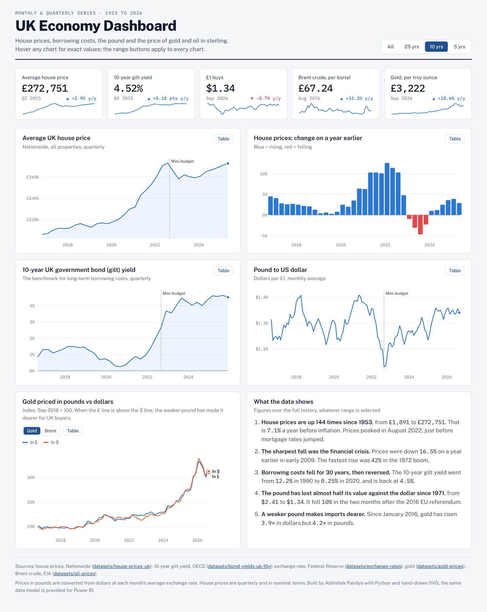

# UK Economy Dashboard

An interactive dashboard of the UK economy: **house prices since 1953**, **10-year gilt yields**, **the pound against the dollar**, and **gold and oil priced in pounds**. It is built in Python and plain HTML/SVG, with the same data model packaged for **Power BI**.

**Tools:** Python (Pandas) · HTML / CSS / JavaScript (hand-drawn SVG charts, no chart library) · Power BI data model and DAX · Playwright for screenshots

👉 **[Open the dashboard](dashboard.html)**: download it and open it in any browser, or see the screenshots below.



## Features

- **Five headline readings** with sparklines and change on a year earlier
- **A time range filter** (All / 25 / 10 / 5 years) that updates every chart at once
- **Hover tooltips** with exact values on every chart, plus a **table view** for each chart (for accessibility and exporting)
- **A Gold / Brent toggle** that compares each commodity's price in pounds and in dollars, indexed to 100
- **Light and dark mode**, following your device setting
- **Works on phones**, with the layout reflowing to one column
- A **colour-blind-safe palette**, checked with a CVD validator

## Key findings

| | |
|---|---|
| 🏠 **House prices** | Up **144×** since 1953 (£1,891 → £272,751), or 7.1% a year before inflation. The sharpest fall was **−16.5%** a year in early 2009; the fastest rise was **+42%** in 1972. |
| 📉 **Borrowing costs** | The 10-year gilt yield fell from **12.2%** (1990) to **0.25%** (2020), and is back to **4.5%**. |
| 💷 **The pound** | Down from **$2.41** (1971) to **$1.34**. It fell 10% in the two months after the 2016 EU referendum, and hit **$1.13** after the September 2022 mini-budget. |
| 🥇 **Imported inflation** | Since January 2016, gold has risen **3.9×** in dollars but **4.2×** in pounds, because a weaker pound makes dollar-priced goods dearer in the UK. |

## How it works

```
data/raw/*.csv ──► prepare_data.py ──┬──► data/processed/monthly_indicators.csv
                                     ├──► powerbi/ (star schema for Power BI)
                                     └──► dashboard.html (data embedded into dashboard_template.html)
```

`prepare_data.py`:
1. Normalises five sources with different dates (mid-month, quarter-end, `YYYY-MM`) to a common monthly calendar
2. Converts the exchange rate from the source's pounds-per-dollar to the market convention, dollars per pound
3. Derives gold and Brent prices in pounds from the dollar price and that month's exchange rate
4. Writes a long-format **fact table** plus **date** and **indicator** dimension tables for Power BI
5. Embeds the cleaned data as JSON into the dashboard, so it runs offline as a single file

### Data quality check
I also evaluated the World Bank consumer inflation series (`datasets/inflation`) and **left it out**. Its UK figures (for example 0.07% for 2021 and 5.4% for 2022) don't match ONS CPI (2.6% and 9.1%), so the dashboard doesn't rely on it.

## Power BI version

[`powerbi/POWER_BI_GUIDE.md`](powerbi/POWER_BI_GUIDE.md) is a step-by-step guide to rebuilding this dashboard in Power BI Desktop. It covers loading the star schema, setting up relationships and the date table, ready-made **DAX measures** (YoY %, latest value, index to 100, CAGR), and a visual-by-visual layout.

## Run it yourself

```bash
pip install pandas
python prepare_data.py     # rebuilds data/processed, powerbi/ and dashboard.html
open dashboard.html        # or double-click it
```

## Sources

| Series | Source | Frequency | Coverage |
|---|---|---|---|
| Average house price and annual change | Nationwide via [datasets/house-prices-uk](https://github.com/datasets/house-prices-uk) | Quarterly | 1953 to Q2 2025 |
| 10-year gilt yield | OECD via [datasets/bond-yields-uk-10y](https://github.com/datasets/bond-yields-uk-10y) | Quarterly | 1984 to Q4 2025 |
| Pound to dollar | Federal Reserve via [datasets/exchange-rates](https://github.com/datasets/exchange-rates) | Monthly | 1971 to Sep 2026 |
| Gold (USD/oz) | [datasets/gold-prices](https://github.com/datasets/gold-prices) | Monthly | to Sep 2026 |
| Brent crude (USD/bbl) | EIA via [datasets/oil-prices](https://github.com/datasets/oil-prices) | Monthly | 1987 to Aug 2026 |

All prices are nominal (not adjusted for inflation).
